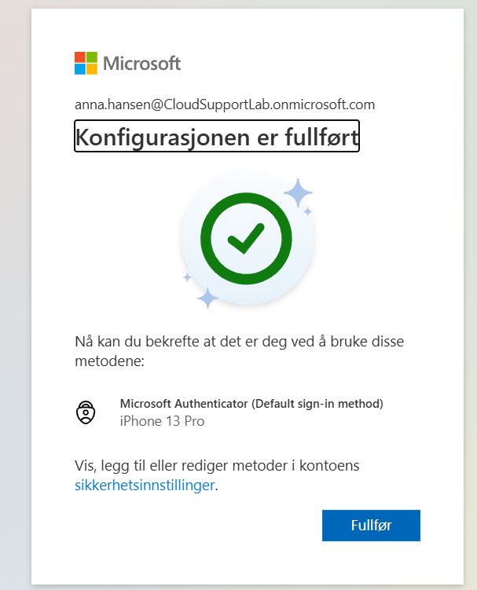
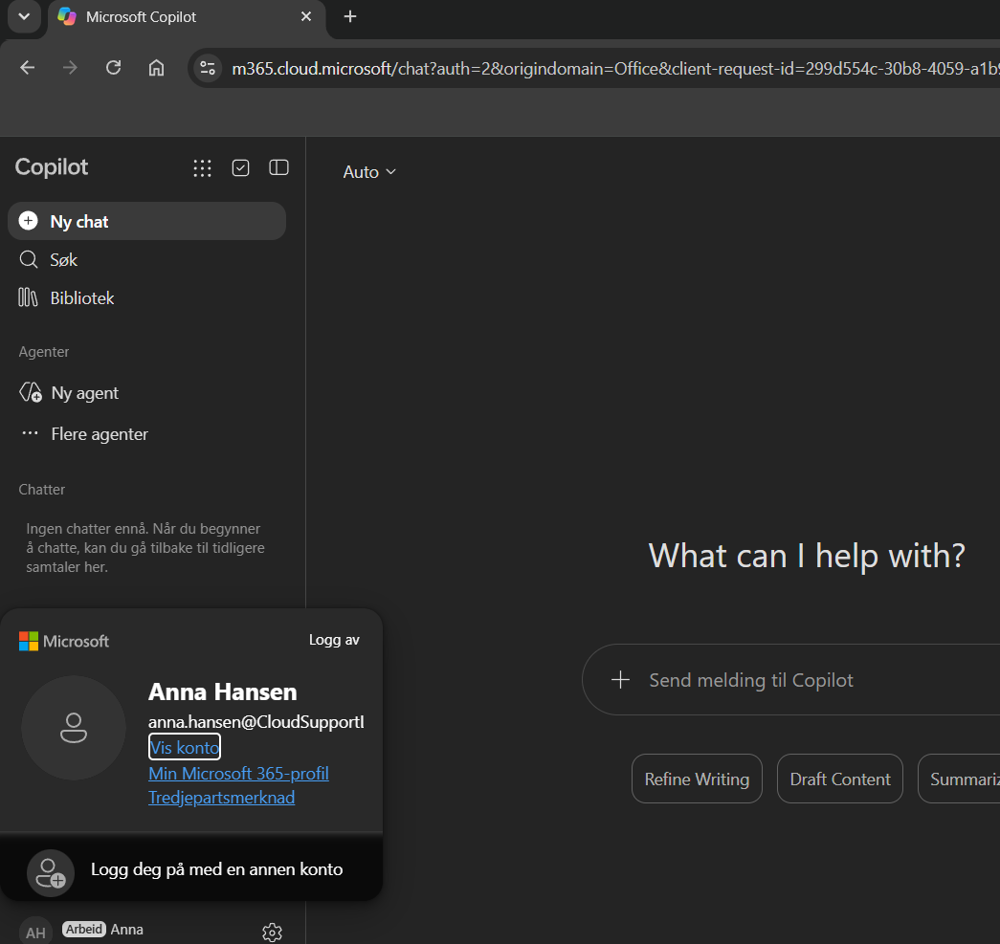

# Ticket 01 – MFA må registreres på nytt

## Problem

Anna Hansen fra HR har fått ny telefon og kan ikke lenger bruke sin eksisterende Microsoft Authenticator-registrering.

Konto:

`anna.hansen@CloudSupportLab.onmicrosoft.com`

Prioritet: Normal

## Feilsøking

Brukerens registrerte autentiseringsmetoder ble kontrollert i Microsoft Entra ID.

Under:

`Users → Anna Hansen → Authentication methods`

ble det bekreftet at Microsoft Authenticator var registrert som brukerens MFA-metode.

## Rotårsak

Microsoft Authenticator var knyttet til brukerens tidligere telefon.

Brukeren måtte derfor registrere multifaktorautentisering på nytt på den nye enheten.

## Løsning

I Microsoft Entra ID ble følgende funksjon brukt:

`Require re-register multifactor authentication`

Eksisterende innloggingsøkter ble også avsluttet slik at brukeren måtte autentisere på nytt.

Ved neste innlogging ble Anna bedt om å registrere Microsoft Authenticator på nytt.

## Verifisering

Brukeren fullførte registreringen av Microsoft Authenticator og kunne deretter logge inn med:

1. Brukernavn og passord
2. Microsoft Authenticator som andre faktor

Innlogging med MFA fungerte som forventet.

## Skjermbilder

### Registrerte autentiseringsmetoder

### MFA registrert på nytt

## Status

Løst
