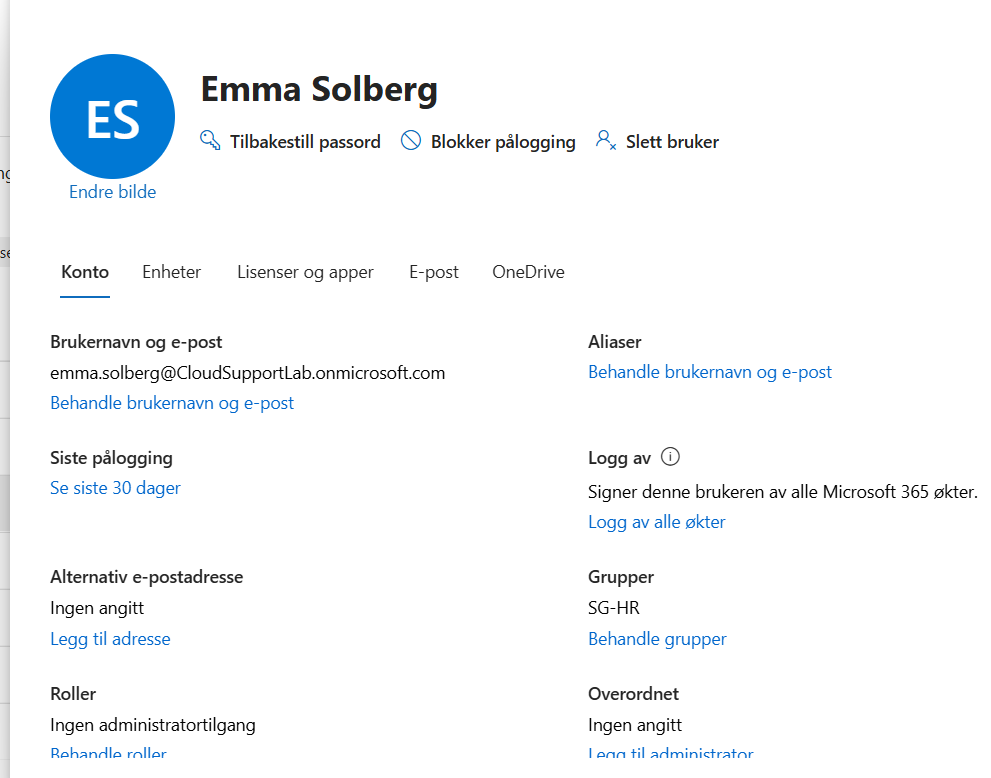
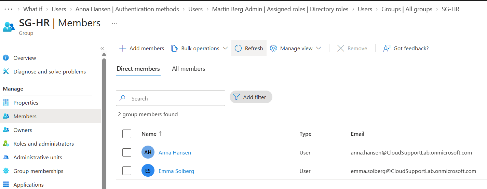
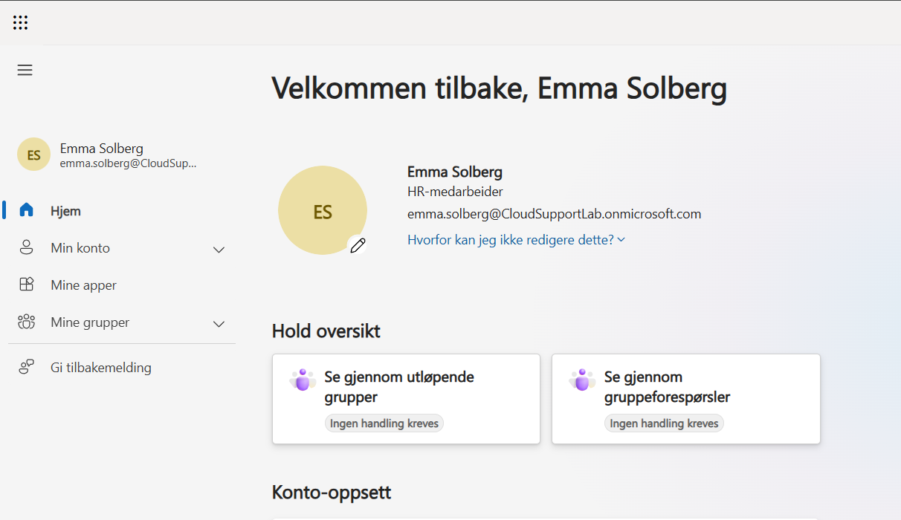

# Ticket 02 – Onboarding av ny ansatt

## Problem / forespørsel

HR meldte inn at en ny ansatt skulle klargjøres for Microsoft 365-miljøet.

Ny bruker:

`Emma Solberg`

Avdeling:

`HR`

Konto:

`emma.solberg@CloudSupportLab.onmicrosoft.com`

Prioritet: Normal

## Oppgaver utført

En ny brukerkonto ble opprettet i Microsoft 365 Admin Center.

Følgende ble konfigurert:

- Visningsnavn: Emma Solberg
- Brukernavn: `emma.solberg`
- Domene: `CloudSupportLab.onmicrosoft.com`
- Sted: Norge
- Avdeling: HR
- Jobbtittel: HR-medarbeider
- Microsoft 365 Business Premium-lisens

Brukeren ble konfigurert med et midlertidig passord og måtte endre passordet ved første innlogging.

## Gruppemedlemskap

Brukeren ble lagt til i Microsoft Entra Security Group:

`SG-HR`

Gruppemedlemskapet ble brukt for å plassere brukeren i riktig organisatorisk tilgangsstruktur.

## Verifisering

Emma Solberg logget inn på Microsoft 365 med den nye kontoen.

Første innlogging ble fullført, og brukeren fikk tilgang til Microsoft 365-miljøet.

Dette bekreftet at:

- brukerkontoen var aktiv
- lisensen var tildelt
- pålogging fungerte
- brukeren var lagt til i riktig Security Group

## Skjermbilder

### Opprettet bruker

### Medlem av SG-HR

### Vellykket innlogging

## Status

Løst
