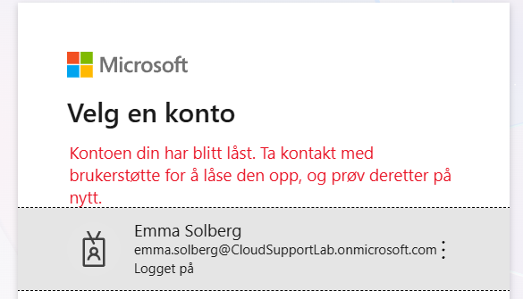

# Ticket 03 – Offboarding av bruker

## Problem / forespørsel

HR meldte at Emma Solberg hadde sluttet i organisasjonen og at tilgangen hennes til Microsoft 365 skulle fjernes.

Konto:

`emma.solberg@CloudSupportLab.onmicrosoft.com`

Prioritet: Normal

## Oppgaver utført

Som en del av offboarding-prosessen ble følgende gjennomført:

- Pålogging til brukerkontoen ble blokkert
- Eksisterende innloggingsøkter ble tilbakekalt
- Brukeren ble fjernet fra `SG-HR`
- Microsoft 365 Business Premium-lisensen ble fjernet

Brukerkontoen ble ikke slettet, slik at kontoen kunne beholdes midlertidig etter offboarding.

## Sikkerhet

Eksisterende sesjoner ble tilbakekalt for å redusere risikoen for at en allerede aktiv økt fortsatt kunne brukes etter at kontoen var blokkert.

Tilgang via Security Groups ble fjernet, og produktlisensen ble frigjort slik at den kunne brukes av en annen bruker.

## Verifisering

Et nytt innloggingsforsøk ble utført med:

`emma.solberg@CloudSupportLab.onmicrosoft.com`

Microsoft nektet innlogging og viste at kontoen var låst/blokkert.

Dette bekreftet at brukeren ikke lenger hadde tilgang til organisasjonens Microsoft 365-miljø.

## Skjermbilder

### Blokkert bruker

## Status

Løst
